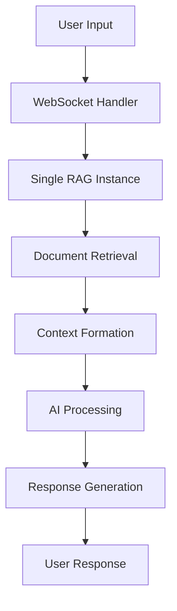
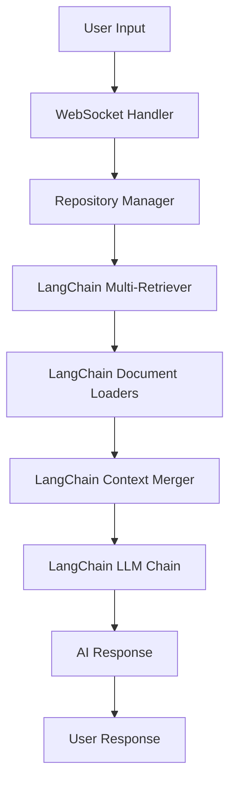

# Multiple Repositories Implementation Plan (LangChain Edition)

## Overview

This document outlines the implementation plan for adding multi-repository support to DeepWiki Chat UI, leveraging LangChain for Retrieval-Augmented Generation (RAG). LangChain will orchestrate document retrieval, context merging, and AI interaction across multiple repositories, improving scalability and maintainability.

## Table of Contents

1. [Project Scope](#project-scope)
2. [Architecture Overview](#architecture-overview)
3. [Implementation Phases](#implementation-phases)
4. [Technical Specifications](#technical-specifications)
5. [LangChain Integration Details](#langchain-integration-details)
6. [API Design](#api-design)
7. [Error Handling Strategy](#error-handling-strategy)
8. [Performance Optimization](#performance-optimization)
9. [Testing Strategy](#testing-strategy)
10. [Migration Plan](#migration-plan)
11. [Risk Assessment](#risk-assessment)
12. [Success Criteria](#success-criteria)

---

## Project Scope

### Objectives

- Support querying and analysis across multiple repositories in a single conversation.
- Use LangChain for RAG orchestration, retrievers, and context management.
- Provide per-repository configuration (filters, tokens, platform types).
- Maintain backward compatibility for single-repository flows.
- Enhance AI analysis and user experience for cross-repository scenarios.

### Out of Scope

- Repository dependency management.
- Cross-repository version control.
- Real-time repository sync.
- Advanced repository relationship mapping.

---

## Architecture Overview

### Current Architecture



### Target Architecture (LangChain)



### Key LangChain Components

- **Document Loaders**: GitHub, GitLab, Bitbucket, local files.
- **Retrievers**: VectorStoreRetriever, MultiQueryRetriever.
- **Chains**: ConversationalRetrievalChain, MultiRetrievalChain.
- **Memory**: ConversationBufferMemory, context window management.
- **Tools**: Custom repository tools for filtering and metadata.

---

## Implementation Phases

### Phase 1: Backend Foundation (Week 1-2)

- Add LangChain to Python dependencies.
- Refactor RAG logic to use LangChain retrievers and chains.
- Implement repository configuration models (Pydantic).
- Build repository manager for loader/retriever orchestration.

### Phase 2: LangChain RAG Integration (Week 3-4)

- Implement LangChain document loaders for each repo type.
- Use MultiRetrievalChain to orchestrate queries across repositories.
- Integrate context merging and deduplication via LangChain.
- Add repository metadata to document context.

### Phase 3: Frontend Components (Week 5-6)

- Update repository management UI for multi-repo config.
- Adapt WebSocket client to new request/response format.
- Display repository context and sources in chat UI.

### Phase 4: Integration, Testing, and Optimization (Week 7-8)

- Add caching and batching for LangChain retrievers.
- Optimize context window and memory usage.
- Comprehensive unit/integration testing.
- Performance benchmarking and monitoring.

---

## Technical Specifications

### Backend (Python, FastAPI, LangChain)

```python
# ...existing code...

from langchain.document_loaders import GitHubLoader, GitLabLoader, BitbucketLoader
from langchain.vectorstores import FAISS
from langchain.chains import MultiRetrievalChain, ConversationalRetrievalChain
from langchain.memory import ConversationBufferMemory

# Repository loader factory
def get_loader(repo_info):
    if repo_info.type == "github":
        return GitHubLoader(repo_url=repo_info.url, token=repo_info.token, branch=repo_info.branch)
    elif repo_info.type == "gitlab":
        return GitLabLoader(repo_url=repo_info.url, token=repo_info.token, branch=repo_info.branch)
    elif repo_info.type == "bitbucket":
        return BitbucketLoader(repo_url=repo_info.url, token=repo_info.token, branch=repo_info.branch)
    # ...other loaders...

# Multi-repository retrieval
def build_multi_repo_chain(repositories, llm, embedding_model):
    retrievers = []
    for repo in repositories:
        loader = get_loader(repo)
        docs = loader.load()
        vectorstore = FAISS.from_documents(docs, embedding_model)
        retriever = vectorstore.as_retriever(search_kwargs={"k": 10})
        retrievers.append(retriever)
    multi_chain = MultiRetrievalChain(
        retrievers=retrievers,
        llm=llm,
        memory=ConversationBufferMemory()
    )
    return multi_chain

# ...existing code...
```

### Frontend (TypeScript, Next.js)

- Update repository input and configuration components.
- Adapt WebSocket client to send/receive repository lists and context.
- Display repository sources and context in chat UI.

---

## LangChain Integration Details

- Use LangChain's built-in document loaders for GitHub, GitLab, Bitbucket.
- For each repository, create a loader and vectorstore retriever.
- Use MultiRetrievalChain to query all retrievers in parallel.
- Merge and deduplicate context using LangChain's context merger.
- Pass merged context to LLM chain for response generation.
- Attach repository metadata to each document for UI display.

---

## API Design

### WebSocket Request

```json
{
  "type": "chat_completion",
  "data": {
    "repositories": [
      { "url": "...", "type": "github", "token": "...", "branch": "main" },
      { "url": "...", "type": "gitlab", "token": "...", "branch": "master" }
    ],
    "messages": [ ... ],
    "configuration": { ... },
    "aiConfig": { ... }
  }
}
```

### WebSocket Response

```json
{
  "type": "chat_response",
  "data": {
    "content": "...",
    "repositoryContext": [
      {
        "repositoryId": "...",
        "alias": "...",
        "url": "...",
        "documentsUsed": 12,
        "files": [ ... ]
      }
    ]
  }
}
```

---

## Error Handling Strategy

- Use LangChain's error handling for loader/retriever failures.
- Return partial results if some repositories fail.
- Provide actionable error messages for repository access issues.
- Log and monitor retriever performance and errors.

---

## Performance Optimization

- Use LangChain's batching and caching for document retrieval.
- Limit context window size per repository.
- Parallelize retriever queries using asyncio.
- Monitor memory and response time; set repository limits.

---

## Testing Strategy

- Unit tests for loader, retriever, and chain construction.
- Integration tests for multi-repository queries and context merging.
- UI tests for repository management and chat display.
- Performance benchmarks for retrieval and response time.

---

## Migration Plan

1. Add LangChain to backend dependencies.
2. Refactor RAG logic to use LangChain modules.
3. Migrate repository configuration and management to new models.
4. Update frontend to support new request/response format.
5. Test and validate multi-repository flows.
6. Roll out in phases with feature flags and user onboarding.

---

## Risk Assessment

| Risk | Impact | Probability | Mitigation |
|------|--------|-------------|------------|
| LangChain API changes | Medium | Low | Pin version, monitor releases |
| Loader/retriever failures | High | Medium | Graceful error handling, retries |
| Performance bottlenecks | High | Medium | Parallelization, caching |
| Migration complexity | Medium | Medium | Incremental rollout, feature flags |

---

## Success Criteria

- [ ] Users can add/remove repositories and configure each.
- [ ] AI responses merge context from all repositories.
- [ ] Repository context is displayed in UI.
- [ ] Performance targets met for 2-5 repositories.
- [ ] Error handling is robust and user-friendly.
- [ ] 95%+ test coverage for new backend logic.

---

## Conclusion

LangChain provides a robust, modular foundation for multi-repository RAG in DeepWiki. By leveraging its document loaders, retrievers, and chains, we accelerate development, improve maintainability, and enable advanced context merging and analysis. This plan ensures a smooth migration and scalable architecture for future growth.