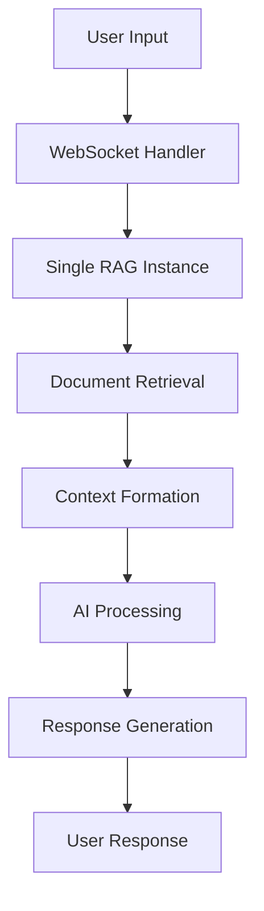
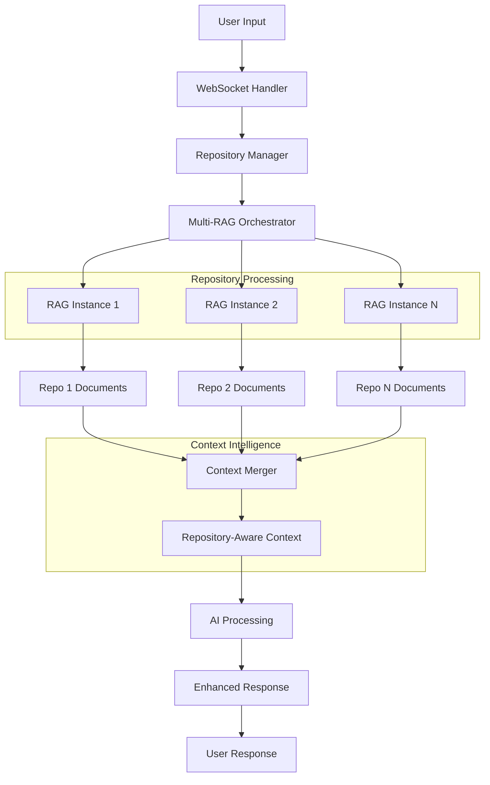
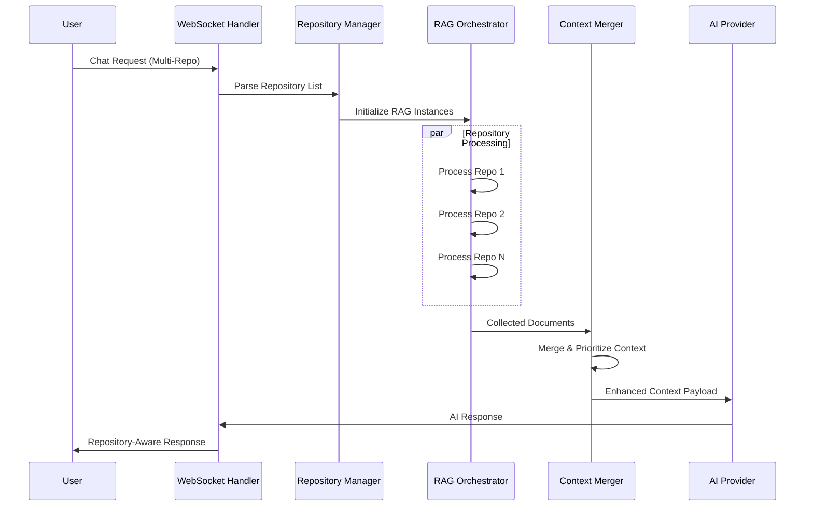

# Multiple Repositories Implementation Plan

## Overview

This document outlines the comprehensive implementation plan for adding multi-repository support to the DeepWiki Chat UI Interface. The goal is to enable users to query and analyze code across multiple repositories simultaneously while maintaining backward compatibility with existing single-repository functionality.

## Table of Contents

1. [Project Scope](#project-scope)
2. [Architecture Overview](#architecture-overview)
3. [Implementation Phases](#implementation-phases)
4. [Technical Specifications](#technical-specifications)
5. [API Design](#api-design)
6. [Error Handling Strategy](#error-handling-strategy)
7. [Performance Optimization](#performance-optimization)
8. [Testing Strategy](#testing-strategy)
9. [User Experience Design](#user-experience-design)
10. [Migration Plan](#migration-plan)
11. [Risk Assessment](#risk-assessment)
12. [Success Criteria](#success-criteria)

## Project Scope

### Objectives
- Enable Chat UI to support multiple repositories in a single conversation
- Maintain backward compatibility with existing single-repository functionality
- Provide per-repository configuration options (filters, tokens, platform types)
- Enhance AI analysis capabilities across multiple codebases
- Improve user experience for cross-repository code analysis
- Implement intelligent context merging and repository-aware responses

### Out of Scope
- Repository dependency management
- Cross-repository version control
- Repository synchronization or mirroring
- Advanced repository relationship mapping
- Real-time repository change notifications

## Architecture Overview

### Current Architecture



### Target Architecture



### Data Flow Architecture



## Implementation Phases

### Phase 1: Backend Foundation (Week 1-2)

#### 1.1 Core Data Models
- **File**: `api/models/repository.py` (new)
- **Tasks**:
  - Create comprehensive `RepositoryInfo` model with validation
  - Implement `RepositoryConfiguration` for advanced settings
  - Add `MultiRepositoryRequest` with backward compatibility
  - Create repository validation and normalization utilities

#### 1.2 Repository Manager
- **File**: `api/services/repository_manager.py` (new)
- **Tasks**:
  - Implement repository lifecycle management
  - Add repository health checking and validation
  - Create repository caching and optimization
  - Implement repository-specific error handling

#### 1.3 Enhanced WebSocket Handler
- **File**: `api/websocket_wiki.py`
- **Tasks**:
  - Integrate repository manager
  - Update request parsing for multi-repository support
  - Implement streaming responses with repository context
  - Add comprehensive error handling and logging

### Phase 2: RAG System Enhancement (Week 3-4)

#### 2.1 Multi-RAG Orchestrator
- **File**: `api/services/multi_rag_orchestrator.py` (new)
- **Tasks**:
  - Implement parallel RAG instance management
  - Add intelligent document retrieval coordination
  - Create repository-aware query processing
  - Implement performance monitoring and optimization

#### 2.2 Context Merger
- **File**: `api/services/context_merger.py` (new)
- **Tasks**:
  - Develop advanced context merging algorithms
  - Implement repository-aware document prioritization
  - Add duplicate detection and deduplication
  - Create context size optimization strategies

#### 2.3 Enhanced RAG Integration
- **File**: `api/rag.py`
- **Tasks**:
  - Add repository metadata tracking
  - Implement repository-specific embeddings
  - Add performance metrics collection
  - Create repository isolation mechanisms

### Phase 3: Frontend Components (Week 5-6)

#### 3.1 Repository Management UI
- **File**: `src/components/RepositoryManager.tsx` (new)
- **Tasks**:
  - Create dynamic repository list with drag-and-drop reordering
  - Implement advanced configuration modals per repository
  - Add repository validation and health indicators
  - Create repository import/export functionality

#### 3.2 Enhanced Configuration Modal
- **File**: `src/components/ConfigurationModal.tsx`
- **Tasks**:
  - Integrate multi-repository management
  - Add repository-specific AI model selection
  - Implement configuration templates and presets
  - Add configuration validation and preview

#### 3.3 Repository-Aware Chat Interface
- **File**: `src/components/ChatInterface.tsx` (new)
- **Tasks**:
  - Create repository context indicators in chat
  - Add repository-specific response formatting
  - Implement repository filtering in responses
  - Add repository-aware code highlighting

### Phase 4: Integration and Optimization (Week 7-8)

#### 4.1 State Management Enhancement
- **File**: `src/contexts/RepositoryContext.tsx` (new)
- **Tasks**:
  - Implement comprehensive repository state management
  - Add repository configuration persistence
  - Create repository session management
  - Implement undo/redo for repository changes

#### 4.2 Performance Optimization
- **Tasks**:
  - Implement request batching and caching
  - Add repository-level performance monitoring
  - Create intelligent preloading strategies
  - Implement memory management optimizations

#### 4.3 Testing and Validation
- **Tasks**:
  - Comprehensive unit and integration testing
  - Performance benchmarking and optimization
  - User experience testing and feedback collection
  - Security testing for multi-repository access

## Technical Specifications

### Enhanced Data Models

```python
# api/models/repository.py
from typing import Optional, List, Dict, Any
from pydantic import BaseModel, Field, validator
from enum import Enum

class RepositoryType(str, Enum):
    GITHUB = "github"
    GITLAB = "gitlab"
    BITBUCKET = "bitbucket"
    AZURE_DEVOPS = "azure_devops"

class RepositoryConfiguration(BaseModel):
    """Advanced repository configuration"""
    max_file_size: int = Field(default=1000000, description="Maximum file size in bytes")
    max_files: int = Field(default=1000, description="Maximum number of files to process")
    include_binary: bool = Field(default=False, description="Include binary files")
    language_filter: Optional[List[str]] = Field(None, description="Programming languages to include")
    priority_weight: float = Field(default=1.0, description="Repository priority weight")
    
class RepositoryInfo(BaseModel):
    """Enhanced repository information model"""
    url: str = Field(..., description="Repository URL")
    type: RepositoryType = Field(RepositoryType.GITHUB, description="Repository platform")
    token: Optional[str] = Field(None, description="Access token")
    branch: Optional[str] = Field("main", description="Branch to analyze")
    
    # File filtering
    excluded_dirs: Optional[str] = Field(None, description="Excluded directories (comma-separated)")
    excluded_files: Optional[str] = Field(None, description="Excluded files (comma-separated)")
    included_dirs: Optional[str] = Field(None, description="Included directories (comma-separated)")
    included_files: Optional[str] = Field(None, description="Included files (comma-separated)")
    
    # Advanced configuration
    config: RepositoryConfiguration = Field(default_factory=RepositoryConfiguration)
    
    # Metadata
    alias: Optional[str] = Field(None, description="User-friendly repository alias")
    description: Optional[str] = Field(None, description="Repository description")
    tags: List[str] = Field(default_factory=list, description="Repository tags")
    
    @validator('url')
    def validate_url(cls, v):
        # Enhanced URL validation logic
        if not v or not v.strip():
            raise ValueError("Repository URL cannot be empty")
        # Add comprehensive URL validation
        return v.strip()

class MultiRepositoryRequest(BaseModel):
    """Enhanced multi-repository request model"""
    repositories: List[RepositoryInfo] = Field(..., description="Repository list")
    messages: List[ChatMessage] = Field(..., description="Chat messages")
    
    # Context configuration
    max_total_context: int = Field(default=8000, description="Maximum total context tokens")
    repository_balance: str = Field(default="equal", description="Repository context balancing strategy")
    
    # AI configuration
    provider: str = Field("google", description="AI model provider")
    model: Optional[str] = Field(None, description="AI model name")
    language: str = Field("en", description="Response language")
    
    # Advanced options
    include_repository_metadata: bool = Field(default=True, description="Include repository metadata in responses")
    cross_repository_analysis: bool = Field(default=True, description="Enable cross-repository analysis")
    
    @validator('repositories', mode='before')
    @classmethod
    def validate_repositories(cls, v):
        """Backward compatibility validator"""
        if isinstance(v, str):
            return [RepositoryInfo(url=v, type=RepositoryType.GITHUB)]
        elif isinstance(v, dict):
            return [RepositoryInfo(**v)]
        return v
```

### Repository Manager Implementation

```python
# api/services/repository_manager.py
import asyncio
from typing import List, Dict, Optional
from dataclasses import dataclass
from ..models.repository import RepositoryInfo, RepositoryType

@dataclass
class RepositoryHealth:
    """Repository health status"""
    is_accessible: bool
    response_time: float
    file_count: int
    total_size: int
    last_updated: str
    errors: List[str]

class RepositoryManager:
    """Manages multiple repositories and their lifecycle"""
    
    def __init__(self):
        self.repositories: Dict[str, RepositoryInfo] = {}
        self.health_cache: Dict[str, RepositoryHealth] = {}
        self.performance_metrics: Dict[str, Dict] = {}
    
    async def add_repository(self, repo_info: RepositoryInfo) -> bool:
        """Add and validate a repository"""
        try:
            # Validate repository accessibility
            health = await self.check_repository_health(repo_info)
            if not health.is_accessible:
                raise ValueError(f"Repository not accessible: {health.errors}")
            
            # Store repository and health info
            repo_id = self.generate_repository_id(repo_info)
            self.repositories[repo_id] = repo_info
            self.health_cache[repo_id] = health
            
            return True
        except Exception as e:
            logger.error(f"Failed to add repository {repo_info.url}: {e}")
            return False
    
    async def check_repository_health(self, repo_info: RepositoryInfo) -> RepositoryHealth:
        """Check repository accessibility and gather metrics"""
        start_time = time.time()
        errors = []
        
        try:
            # Platform-specific health checking
            if repo_info.type == RepositoryType.GITHUB:
                health_data = await self._check_github_health(repo_info)
            elif repo_info.type == RepositoryType.GITLAB:
                health_data = await self._check_gitlab_health(repo_info)
            # Add other platform checks
            
            response_time = time.time() - start_time
            
            return RepositoryHealth(
                is_accessible=True,
                response_time=response_time,
                file_count=health_data.get('file_count', 0),
                total_size=health_data.get('total_size', 0),
                last_updated=health_data.get('last_updated', ''),
                errors=errors
            )
        except Exception as e:
            errors.append(str(e))
            return RepositoryHealth(
                is_accessible=False,
                response_time=time.time() - start_time,
                file_count=0,
                total_size=0,
                last_updated='',
                errors=errors
            )
```

## API Design

### WebSocket Message Format

```typescript
// Enhanced WebSocket message structures
interface MultiRepositoryRequest {
  type: 'chat_completion';
  data: {
    repositories: RepositoryInfo[];
    messages: ChatMessage[];
    configuration: {
      maxTotalContext: number;
      repositoryBalance: 'equal' | 'priority' | 'smart';
      crossRepositoryAnalysis: boolean;
      includeRepositoryMetadata: boolean;
    };
    aiConfig: {
      provider: string;
      model?: string;
      language: string;
    };
  };
}

interface MultiRepositoryResponse {
  type: 'chat_response' | 'error' | 'progress';
  data: {
    content?: string;
    repositoryContext?: RepositoryContext[];
    metadata?: ResponseMetadata;
    error?: ErrorInfo;
    progress?: ProgressInfo;
  };
}

interface RepositoryContext {
  repositoryId: string;
  alias: string;
  url: string;
  documentsUsed: number;
  relevanceScore: number;
  files: FileReference[];
}
```

### REST API Endpoints

```python
# Enhanced API endpoints for repository management
@app.post("/api/repositories/validate")
async def validate_repositories(repositories: List[RepositoryInfo]):
    """Validate multiple repositories"""
    results = []
    for repo in repositories:
        health = await repository_manager.check_repository_health(repo)
        results.append({
            "repository": repo.url,
            "valid": health.is_accessible,
            "metrics": health.__dict__,
        })
    return {"results": results}

@app.post("/api/repositories/batch-add")
async def batch_add_repositories(repositories: List[RepositoryInfo]):
    """Add multiple repositories in batch"""
    results = await repository_manager.batch_add_repositories(repositories)
    return {"results": results}

@app.get("/api/repositories/{repo_id}/health")
async def get_repository_health(repo_id: str):
    """Get repository health status"""
    health = await repository_manager.get_repository_health(repo_id)
    return {"health": health}
```

## Error Handling Strategy

### Repository-Level Error Handling

```python
class RepositoryError(Exception):
    """Base repository error"""
    def __init__(self, repository_url: str, message: str, error_code: str = None):
        self.repository_url = repository_url
        self.error_code = error_code
        super().__init__(message)

class RepositoryAccessError(RepositoryError):
    """Repository access denied or not found"""
    pass

class RepositoryTimeoutError(RepositoryError):
    """Repository request timeout"""
    pass

class RepositoryQuotaError(RepositoryError):
    """Repository API quota exceeded"""
    pass

# Error handling in multi-repository processing
async def process_repositories_with_fallback(repositories: List[RepositoryInfo]):
    """Process repositories with graceful error handling"""
    successful_repos = []
    failed_repos = []
    
    for repo in repositories:
        try:
            result = await process_repository(repo)
            successful_repos.append(result)
        except RepositoryAccessError as e:
            failed_repos.append({
                "repository": repo.url,
                "error": "access_denied",
                "message": str(e),
                "recoverable": False
            })
        except RepositoryTimeoutError as e:
            failed_repos.append({
                "repository": repo.url,
                "error": "timeout",
                "message": str(e),
                "recoverable": True
            })
        except Exception as e:
            failed_repos.append({
                "repository": repo.url,
                "error": "unknown",
                "message": str(e),
                "recoverable": False
            })
    
    # Continue processing with successful repositories
    if not successful_repos:
        raise ValueError("No repositories could be processed successfully")
    
    return {
        "successful": successful_repos,
        "failed": failed_repos,
        "partial_success": len(failed_repos) > 0
    }
```

### Frontend Error Handling

```typescript
// Enhanced error handling in frontend
interface RepositoryError {
  repositoryUrl: string;
  errorType: 'access_denied' | 'timeout' | 'quota_exceeded' | 'unknown';
  message: string;
  recoverable: boolean;
  suggestedActions: string[];
}

const handleRepositoryErrors = (errors: RepositoryError[]) => {
  errors.forEach(error => {
    switch (error.errorType) {
      case 'access_denied':
        showToast({
          type: 'error',
          title: 'Repository Access Denied',
          message: `Cannot access ${error.repositoryUrl}. Please check your token.`,
          actions: ['Update Token', 'Remove Repository']
        });
        break;
      
      case 'timeout':
        showToast({
          type: 'warning',
          title: 'Repository Timeout',
          message: `${error.repositoryUrl} is taking too long to respond.`,
          actions: ['Retry', 'Skip Repository']
        });
        break;
      
      case 'quota_exceeded':
        showToast({
          type: 'error',
          title: 'API Quota Exceeded',
          message: `Rate limit exceeded for ${error.repositoryUrl}.`,
          actions: ['Wait and Retry', 'Use Different Token']
        });
        break;
    }
  });
};
```

## Performance Optimization

### Parallel Processing Strategy

```python
# Optimized parallel repository processing
import asyncio
from concurrent.futures import ThreadPoolExecutor
from typing import List, Dict, Any

class PerformanceOptimizer:
    """Optimizes multi-repository processing performance"""
    
    def __init__(self, max_concurrent_repos: int = 5):
        self.max_concurrent_repos = max_concurrent_repos
        self.performance_metrics = {}
    
    async def process_repositories_optimized(
        self, 
        repositories: List[RepositoryInfo],
        query: str
    ) -> Dict[str, Any]:
        """Process repositories with performance optimization"""
        
        # Group repositories by priority and size
        repo_groups = self._group_repositories_by_performance(repositories)
        
        # Process high-priority repositories first
        high_priority_results = await self._process_repo_group(
            repo_groups['high_priority'], 
            query,
            max_concurrent=self.max_concurrent_repos
        )
        
        # Process remaining repositories if context space available
        remaining_context = self._calculate_remaining_context(high_priority_results)
        if remaining_context > 1000:  # Minimum context threshold
            low_priority_results = await self._process_repo_group(
                repo_groups['low_priority'],
                query,
                max_concurrent=min(3, self.max_concurrent_repos),
                context_limit=remaining_context
            )
        else:
            low_priority_results = []
        
        return self._merge_results(high_priority_results, low_priority_results)
    
    async def _process_repo_group(
        self,
        repositories: List[RepositoryInfo],
        query: str,
        max_concurrent: int,
        context_limit: Optional[int] = None
    ) -> List[Dict]:
        """Process a group of repositories concurrently"""
        
        semaphore = asyncio.Semaphore(max_concurrent)
        
        async def process_single_repo(repo: RepositoryInfo):
            async with semaphore:
                start_time = time.time()
                try:
                    result = await self._process_repository_with_timeout(
                        repo, query, timeout=30.0
                    )
                    
                    # Record performance metrics
                    processing_time = time.time() - start_time
                    self.performance_metrics[repo.url] = {
                        'processing_time': processing_time,
                        'documents_retrieved': len(result.get('documents', [])),
                        'context_tokens': result.get('context_tokens', 0),
                        'success': True
                    }
                    
                    return result
                except Exception as e:
                    self.performance_metrics[repo.url] = {
                        'processing_time': time.time() - start_time,
                        'error': str(e),
                        'success': False
                    }
                    return None
        
        # Execute all repository processing tasks
        tasks = [process_single_repo(repo) for repo in repositories]
        results = await asyncio.gather(*tasks, return_exceptions=True)
        
        # Filter successful results
        return [r for r in results if r is not None and not isinstance(r, Exception)]

# Caching strategy for repository data
class RepositoryCache:
    """Advanced caching for repository data"""
    
    def __init__(self, max_cache_size: int = 100):
        self.cache = {}
        self.max_cache_size = max_cache_size
        self.access_times = {}
    
    async def get_cached_documents(
        self, 
        repo_url: str, 
        query_hash: str
    ) -> Optional[List[Document]]:
        """Get cached documents for repository and query"""
        cache_key = f"{repo_url}:{query_hash}"
        
        if cache_key in self.cache:
            self.access_times[cache_key] = time.time()
            return self.cache[cache_key]
        
        return None
    
    async def cache_documents(
        self,
        repo_url: str,
        query_hash: str,
        documents: List[Document]
    ):
        """Cache documents for future retrieval"""
        cache_key = f"{repo_url}:{query_hash}"
        
        # Implement LRU eviction if cache is full
        if len(self.cache) >= self.max_cache_size:
            self._evict_oldest_entries()
        
        self.cache[cache_key] = documents
        self.access_times[cache_key] = time.time()
```

### Memory Management

```python
# Memory management for large repository sets
class MemoryManager:
    """Manages memory usage during multi-repository processing"""
    
    def __init__(self, max_memory_mb: int = 2048):
        self.max_memory_mb = max_memory_mb
        self.current_memory_usage = 0
        self.repository_memory_usage = {}
    
    def estimate_repository_memory(self, repo_info: RepositoryInfo) -> int:
        """Estimate memory usage for a repository"""
        # Base estimation logic
        estimated_files = repo_info.config.max_files
        avg_file_size = repo_info.config.max_file_size * 0.1  # Assume 10% text content
        estimated_memory = estimated_files * avg_file_size * 2  # 2x for processing overhead
        
        return min(estimated_memory, 500 * 1024 * 1024)  # Cap at 500MB per repo
    
    def can_process_repository(self, repo_info: RepositoryInfo) -> bool:
        """Check if repository can be processed within memory limits"""
        estimated_memory = self.estimate_repository_memory(repo_info)
        available_memory = (self.max_memory_mb * 1024 * 1024) - self.current_memory_usage
        
        return estimated_memory <= available_memory
    
    def allocate_memory(self, repo_url: str, amount: int):
        """Allocate memory for repository processing"""
        self.current_memory_usage += amount
        self.repository_memory_usage[repo_url] = amount
    
    def deallocate_memory(self, repo_url: str):
        """Deallocate memory after repository processing"""
        if repo_url in self.repository_memory_usage:
            self.current_memory_usage -= self.repository_memory_usage[repo_url]
            del self.repository_memory_usage[repo_url]
```

## Testing Strategy

### Comprehensive Test Scenarios

```python
# Enhanced testing scenarios
import pytest
from unittest.mock import Mock, patch
from ..models.repository import RepositoryInfo, RepositoryType

class TestMultiRepositorySystem:
    """Comprehensive test suite for multi-repository functionality"""
    
    @pytest.fixture
    def sample_repositories(self):
        """Sample repository configurations for testing"""
        return [
            RepositoryInfo(
                url="https://github.com/user/repo1",
                type=RepositoryType.GITHUB,
                alias="Primary Repo"
            ),
            RepositoryInfo(
                url="https://gitlab.com/user/repo2",
                type=RepositoryType.GITLAB,
                alias="Secondary Repo"
            ),
            RepositoryInfo(
                url="https://bitbucket.org/user/repo3",
                type=RepositoryType.BITBUCKET,
                alias="Legacy Repo"
            )
        ]
    
    async def test_single_repository_backward_compatibility(self):
        """Test backward compatibility with single repository requests"""
        # Test string URL conversion
        request_data = {"repositories": "https://github.com/user/repo"}
        request = MultiRepositoryRequest(**request_data)
        
        assert len(request.repositories) == 1
        assert request.repositories[0].url == "https://github.com/user/repo"
        assert request.repositories[0].type == RepositoryType.GITHUB
    
    async def test_multiple_repository_processing(self, sample_repositories):
        """Test processing multiple repositories simultaneously"""
        with patch('api.services.repository_manager.RepositoryManager') as mock_manager:
            mock_manager.return_value.process_repositories.return_value = {
                'successful': sample_repositories,
                'failed': [],
                'partial_success': False
            }
            
            result = await process_multi_repository_request(sample_repositories, "test query")
            
            assert len(result['successful']) == 3
            assert len(result['failed']) == 0
    
    async def test_repository_failure_handling(self, sample_repositories):
        """Test graceful handling of repository failures"""
        # Simulate one repository failure
        with patch('api.services.repository_manager.RepositoryManager') as mock_manager:
            mock_manager.return_value.process_repositories.return_value = {
                'successful': sample_repositories[:2],  # First two succeed
                'failed': [{
                    'repository': sample_repositories[2].url,
                    'error': 'access_denied',
                    'message': 'Repository not accessible',
                    'recoverable': False
                }],
                'partial_success': True
            }
            
            result = await process_multi_repository_request(sample_repositories, "test query")
            
            assert len(result['successful']) == 2
            assert len(result['failed']) == 1
            assert result['partial_success'] is True
    
    async def test_performance_under_load(self, sample_repositories):
        """Test system performance with multiple repositories"""
        start_time = time.time()
        
        # Process repositories multiple times to test performance
        tasks = []
        for _ in range(10):  # Simulate 10 concurrent requests
            task = process_multi_repository_request(sample_repositories, "test query")
            tasks.append(task)
        
        results = await asyncio.gather(*tasks)
        processing_time = time.time() - start_time
        
        # Performance assertions
        assert processing_time < 30.0  # Should complete within 30 seconds
        assert all(len(result['successful']) > 0 for result in results)
    
    async def test_memory_management(self):
        """Test memory management with large repository sets"""
        # Create many repositories to test memory limits
        large_repo_set = [
            RepositoryInfo(
                url=f"https://github.com/user/repo{i}",
                type=RepositoryType.GITHUB
            ) for i in range(20)  # 20 repositories
        ]
        
        memory_manager = MemoryManager(max_memory_mb=1024)  # 1GB limit
        
        processable_repos = []
        for repo in large_repo_set:
            if memory_manager.can_process_repository(repo):
                processable_repos.append(repo)
                estimated_memory = memory_manager.estimate_repository_memory(repo)
                memory_manager.allocate_memory(repo.url, estimated_memory)
        
        # Should not exceed memory limits
        assert memory_manager.current_memory_usage <= 1024 * 1024 * 1024
        assert len(processable_repos) > 0  # Should process some repositories

# Performance benchmarking
class TestPerformanceBenchmarks:
    """Performance benchmark tests"""
    
    @pytest.mark.benchmark
    async def test_repository_processing_speed(self, benchmark):
        """Benchmark repository processing speed"""
        repos = [RepositoryInfo(url=f"https://github.com/user/repo{i}") for i in range(5)]
        
        result = benchmark(process_multi_repository_request, repos, "test query")
        
        # Benchmark assertions
        assert len(result['successful']) > 0
    
    @pytest.mark.benchmark
    async def test_context_merging_performance(self, benchmark):
        """Benchmark context merging performance"""
        # Create large document sets to test merging performance
        large_document_set = [create_mock_document() for _ in range(1000)]
        
        result = benchmark(merge_repository_contexts, large_document_set)
        
        assert len(result) > 0
        assert len(result) <= 100  # Should limit context size

# Integration tests
class TestIntegrationScenarios:
    """Integration test scenarios"""
    
    async def test_end_to_end_multi_repository_chat(self):
        """Test complete end-to-end multi-repository chat flow"""
        # Simulate real WebSocket request
        websocket_message = {
            "type": "chat_completion",
            "data": {
                "repositories": [
                    {
                        "url": "https://github.com/microsoft/vscode",
                        "type": "github",
                        "alias": "VS Code"
                    },
                    {
                        "url": "https://github.com/microsoft/typescript",
                        "type": "github", 
                        "alias": "TypeScript"
                    }
                ],
                "messages": [
                    {
                        "role": "user",
                        "content": "How does VS Code integrate with TypeScript?"
                    }
                ]
            }
        }
        
        # Process through full pipeline
        response = await process_websocket_message(websocket_message)
        
        # Assertions
        assert response['type'] == 'chat_response'
        assert 'content' in response['data']
        assert 'repositoryContext' in response['data']
        assert len(response['data']['repositoryContext']) == 2
```

## User Experience Design

### Repository Management Interface

```typescript
// Enhanced repository management component
interface RepositoryManagerProps {
  repositories: RepositoryInfo[];
  onRepositoriesChange: (repos: RepositoryInfo[]) => void;
  maxRepositories?: number;
}

const RepositoryManager: React.FC<RepositoryManagerProps> = ({
  repositories,
  onRepositoriesChange,
  maxRepositories = 10
}) => {
  const [draggedIndex, setDraggedIndex] = useState<number | null>(null);
  const [validationResults, setValidationResults] = useState<Map<string, ValidationResult>>(new Map());

  const validateRepository = async (repo: RepositoryInfo): Promise<ValidationResult> => {
    try {
      const response = await fetch('/api/repositories/validate', {
        method: 'POST',
        headers: { 'Content-Type': 'application/json' },
        body: JSON.stringify([repo])
      });
      
      const result = await response.json();
      return result.results[0];
    } catch (error) {
      return {
        valid: false,
        error: 'Failed to validate repository',
        suggestions: ['Check URL format', 'Verify repository exists']
      };
    }
  };

  const handleRepositoryAdd = () => {
    if (repositories.length >= maxRepositories) {
      showToast({
        type: 'warning',
        message: `Maximum ${maxRepositories} repositories allowed`
      });
      return;
    }

    const newRepo: RepositoryInfo = {
      url: '',
      type: 'github',
      alias: `Repository ${repositories.length + 1}`
    };
    
    onRepositoriesChange([...repositories, newRepo]);
  };

  const handleRepositoryRemove = (index: number) => {
    const updatedRepos = repositories.filter((_, i) => i !== index);
    onRepositoriesChange(updatedRepos);
  };

  const handleRepositoryReorder = (fromIndex: number, toIndex: number) => {
    const reorderedRepos = [...repositories];
    const [movedRepo] = reorderedRepos.splice(fromIndex, 1);
    reorderedRepos.splice(toIndex, 0, movedRepo);
    onRepositoriesChange(reorderedRepos);
  };

  return (
    <div className="repository-manager">
      <div className="repository-header">
        <h3>Repositories ({repositories.length}/{maxRepositories})</h3>
        <Button
          onClick={handleRepositoryAdd}
          disabled={repositories.length >= maxRepositories}
          className="add-repository-btn"
        >
          <Plus size={16} />
          Add Repository
        </Button>
      </div>

      <div className="repository-list">
        {repositories.map((repo, index) => (
          <RepositoryCard
            key={index}
            repository={repo}
            index={index}
            validationResult={validationResults.get(repo.url)}
            onUpdate={(updatedRepo) => {
              const updatedRepos = [...repositories];
              updatedRepos[index] = updatedRepo;
              onRepositoriesChange(updatedRepos);
            }}
            onRemove={() => handleRepositoryRemove(index)}
            onValidate={validateRepository}
            onDragStart={(dragIndex) => setDraggedIndex(dragIndex)}
            onDragEnd={() => setDraggedIndex(null)}
            onDrop={(dropIndex) => {
              if (draggedIndex !== null) {
                handleRepositoryReorder(draggedIndex, dropIndex);
              }
            }}
            isDragging={draggedIndex === index}
          />
        ))}
      </div>

      {repositories.length === 0 && (
        <div className="empty-state">
          <GitBranch size={48} className="empty-icon" />
          <h4>No repositories added</h4>
          <p>Add repositories to start analyzing code across multiple projects</p>
          <Button onClick={handleRepositoryAdd} variant="primary">
            Add Your First Repository
          </Button>
        </div>
      )}
    </div>
  );
};
```

### Repository Card Component

```typescript
// Individual repository card with advanced configuration
interface RepositoryCardProps {
  repository: RepositoryInfo;
  index: number;
  validationResult?: ValidationResult;
  onUpdate: (repo: RepositoryInfo) => void;
  onRemove: () => void;
  onValidate: (repo: RepositoryInfo) => Promise<ValidationResult>;
  onDragStart: (index: number) => void;
  onDragEnd: () => void;
  onDrop: (index: number) => void;
  isDragging: boolean;
}

const RepositoryCard: React.FC<RepositoryCardProps> = ({
  repository,
  index,
  validationResult,
  onUpdate,
  onRemove,
  onValidate,
  onDragStart,
  onDragEnd,
  onDrop,
  isDragging
}) => {
  const [isExpanded, setIsExpanded] = useState(false);
  const [isValidating, setIsValidating] = useState(false);
  const [showAdvancedConfig, setShowAdvancedConfig] = useState(false);

  const handleValidation = async () => {
    if (!repository.url.trim()) return;
    
    setIsValidating(true);
    try {
      await onValidate(repository);
    } finally {
      setIsValidating(false);
    }
  };

  const getRepositoryIcon = (type: string) => {
    switch (type) {
      case 'github': return <Github size={20} />;
      case 'gitlab': return <GitBranch size={20} />;
      case 'bitbucket': return <Package size={20} />;
      default: return <Folder size={20} />;
    }
  };

  const getValidationIcon = () => {
    if (isValidating) return <Loader2 className="animate-spin" size={16} />;
    if (!validationResult) return <AlertCircle className="text-gray-400" size={16} />;
    if (validationResult.valid) return <CheckCircle className="text-green-500" size={16} />;
    return <XCircle className="text-red-500" size={16} />;
  };

  return (
    <div
      className={`repository-card ${isDragging ? 'dragging' : ''} ${
        validationResult?.valid ? 'valid' : validationResult ? 'invalid' : 'unvalidated'
      }`}
      draggable
      onDragStart={() => onDragStart(index)}
      onDragEnd={onDragEnd}
      onDragOver={(e) => e.preventDefault()}
      onDrop={() => onDrop(index)}
    >
      <div className="repository-header">
        <div className="repository-info">
          <div className="repository-icon">
            {getRepositoryIcon(repository.type)}
          </div>
          <div className="repository-details">
            <input
              type="text"
              placeholder="Repository alias"
              value={repository.alias || ''}
              onChange={(e) => onUpdate({ ...repository, alias: e.target.value })}
              className="repository-alias-input"
            />
            <input
              type="url"
              placeholder="Repository URL"
              value={repository.url}
              onChange={(e) => onUpdate({ ...repository, url: e.target.value })}
              className="repository-url-input"
              onBlur={handleValidation}
            />
          </div>
        </div>
        
        <div className="repository-actions">
          <button
            onClick={handleValidation}
            disabled={isValidating || !repository.url.trim()}
            className="validate-btn"
            title="Validate repository"
          >
            {getValidationIcon()}
          </button>
          
          <button
            onClick={() => setIsExpanded(!isExpanded)}
            className="expand-btn"
            title="Expand configuration"
          >
            <ChevronDown
              className={`transform transition-transform ${isExpanded ? 'rotate-180' : ''}`}
              size={16}
            />
          </button>
          
          <button
            onClick={onRemove}
            className="remove-btn"
            title="Remove repository"
          >
            <Trash2 size={16} />
          </button>
        </div>
      </div>

      {validationResult && !validationResult.valid && (
        <div className="validation-error">
          <AlertCircle size={14} />
          <span>{validationResult.error}</span>
          {validationResult.suggestions && (
            <ul className="suggestions">
              {validationResult.suggestions.map((suggestion, i) => (
                <li key={i}>{suggestion}</li>
              ))}
            </ul>
          )}
        </div>
      )}

      {isExpanded && (
        <div className="repository-config">
          <div className="config-section">
            <label>Repository Type</label>
            <select
              value={repository.type}
              onChange={(e) => onUpdate({ ...repository, type: e.target.value as RepositoryType })}
            >
              <option value="github">GitHub</option>
              <option value="gitlab">GitLab</option>
              <option value="bitbucket">Bitbucket</option>
              <option value="azure_devops">Azure DevOps</option>
            </select>
          </div>

          <div className="config-section">
            <label>Access Token</label>
            <input
              type="password"
              placeholder="Personal access token (optional)"
              value={repository.token || ''}
              onChange={(e) => onUpdate({ ...repository, token: e.target.value })}
            />
          </div>

          <div className="config-section">
            <label>Branch</label>
            <input
              type="text"
              placeholder="main"
              value={repository.branch || ''}
              onChange={(e) => onUpdate({ ...repository, branch: e.target.value })}
            />
          </div>

          <div className="config-toggles">
            <label>
              <input
                type="checkbox"
                checked={showAdvancedConfig}
                onChange={(e) => setShowAdvancedConfig(e.target.checked)}
              />
              Advanced Configuration
            </label>
          </div>

          {showAdvancedConfig && (
            <div className="advanced-config">
              <div className="filter-section">
                <h4>File Filters</h4>
                <div className="filter-inputs">
                  <input
                    placeholder="Excluded directories (comma-separated)"
                    value={repository.excluded_dirs || ''}
                    onChange={(e) => onUpdate({ ...repository, excluded_dirs: e.target.value })}
                  />
                  <input
                    placeholder="Excluded files (comma-separated)"
                    value={repository.excluded_files || ''}
                    onChange={(e) => onUpdate({ ...repository, excluded_files: e.target.value })}
                  />
                  <input
                    placeholder="Included directories (comma-separated)"
                    value={repository.included_dirs || ''}
                    onChange={(e) => onUpdate({ ...repository, included_dirs: e.target.value })}
                  />
                  <input
                    placeholder="Included files (comma-separated)"
                    value={repository.included_files || ''}
                    onChange={(e) => onUpdate({ ...repository, included_files: e.target.value })}
                  />
                </div>
              </div>

              <div className="priority-section">
                <label>Priority Weight</label>
                <input
                  type="range"
                  min="0.1"
                  max="2.0"
                  step="0.1"
                  value={repository.config?.priority_weight || 1.0}
                  onChange={(e) => onUpdate({
                    ...repository,
                    config: { ...repository.config, priority_weight: parseFloat(e.target.value) }
                  })}
                />
                <span>{repository.config?.priority_weight || 1.0}</span>
              </div>
            </div>
          )}
        </div>
      )}
    </div>
  );
};
```

### Chat Interface with Repository Context

```typescript
// Enhanced chat interface showing repository context
interface ChatMessageWithContext extends ChatMessage {
  repositoryContext?: RepositoryContext[];
  crossRepositoryInsights?: CrossRepositoryInsight[];
}

const ChatInterface: React.FC = () => {
  const [messages, setMessages] = useState<ChatMessageWithContext[]>([]);
  const [showRepositoryContext, setShowRepositoryContext] = useState(true);

  const renderMessageWithContext = (message: ChatMessageWithContext, index: number) => {
    if (message.role === 'assistant' && message.repositoryContext) {
      return (
        <div key={index} className="assistant-message-container">
          <div className="message-content">
            <ReactMarkdown>{message.content}</ReactMarkdown>
          </div>
          
          {showRepositoryContext && (
            <div className="repository-context">
              <div className="context-header">
                <span>Sources from {message.repositoryContext.length} repositories</span>
                <button
                  onClick={() => setShowRepositoryContext(!showRepositoryContext)}
                  className="toggle-context-btn"
                >
                  <Eye size={14} />
                </button>
              </div>
              
              <div className="context-repositories">
                {message.repositoryContext.map((repo, repoIndex) => (
                  <div key={repoIndex} className="context-repository">
                    <div className="repo-header">
                      <div className="repo-info">
                        <span className="repo-alias">{repo.alias}</span>
                        <span className="repo-url">{repo.url}</span>
                      </div>
                      <div className="repo-metrics">
                        <span className="documents-count">{repo.documentsUsed} files</span>
                        <span className="relevance-score">
                          {(repo.relevanceScore * 100).toFixed(0)}% relevant
                        </span>
                      </div>
                    </div>
                    
                    <div className="repo-files">
                      {repo.files.slice(0, 5).map((file, fileIndex) => (
                        <div key={fileIndex} className="context-file">
                          <span className="file-path">{file.path}</span>
                          <span className="file-relevance">{file.relevance}%</span>
                        </div>
                      ))}
                      {repo.files.length > 5 && (
                        <span className="more-files">
                          +{repo.files.length - 5} more files
                        </span>
                      )}
                    </div>
                  </div>
                ))}
              </div>
              
              {message.crossRepositoryInsights && (
                <div className="cross-repo-insights">
                  <h4>Cross-Repository Insights</h4>
                  {message.crossRepositoryInsights.map((insight, insightIndex) => (
                    <div key={insightIndex} className="insight">
                      <span className="insight-type">{insight.type}</span>
                      <span className="insight-description">{insight.description}</span>
                    </div>
                  ))}
                </div>
              )}
            </div>
          )}
        </div>
      );
    }

    return (
      <div key={index} className={`message ${message.role}`}>
        <ReactMarkdown>{message.content}</ReactMarkdown>
      </div>
    );
  };

  return (
    <div className="chat-interface">
      <div className="messages-container">
        {messages.map(renderMessageWithContext)}
      </div>
      
      <div className="chat-input-container">
        {/* Chat input component */}
      </div>
    </div>
  );
};
```

## Migration Plan

### Phase 1: Infrastructure Preparation (Week 1)
- **Database Schema Updates**: Add multi-repository support tables
- **Configuration Migration**: Update existing configurations
- **Feature Flags**: Implement feature toggles for gradual rollout

### Phase 2: Backend Deployment (Week 2-3)
- **API Versioning**: Deploy new API endpoints with version control
- **Backward Compatibility**: Ensure existing single-repository requests continue working
- **Performance Monitoring**: Implement comprehensive monitoring and alerting

### Phase 3: Frontend Rollout (Week 4-5)
- **Progressive Enhancement**: Roll out new UI components incrementally
- **User Onboarding**: Create guided tours for new multi-repository features
- **Feedback Collection**: Implement user feedback mechanisms

### Phase 4: Full Migration (Week 6-8)
- **Feature Completion**: Enable all multi-repository features
- **Performance Optimization**: Fine-tune based on real-world usage
- **Documentation**: Complete user guides and API documentation

## Risk Assessment

### Technical Risks

| Risk | Impact | Probability | Mitigation |
|------|--------|-------------|------------|
| Performance degradation with multiple repositories | High | Medium | Implement parallel processing, caching, and request optimization |
| Memory consumption with large repository sets | High | Medium | Add memory management and repository limits |
| Context merging complexity | Medium | High | Develop comprehensive testing and validation |
| Repository access failures | Medium | High | Implement graceful error handling and fallback mechanisms |

### Business Risks

| Risk | Impact | Probability | Mitigation |
|------|--------|-------------|------------|
| User confusion with new interface | Medium | Medium | Provide comprehensive onboarding and documentation |
| Increased infrastructure costs | Medium | Low | Monitor usage and optimize resource allocation |
| Support overhead | Low | Medium | Create detailed troubleshooting guides |

## Success Criteria

### Functional Requirements
- [ ] Users can manage up to 10 repositories simultaneously
- [ ] Each repository supports individual configuration (tokens, filters, branches)
- [ ] AI responses intelligently merge context from all repositories
- [ ] Repository validation provides clear feedback and suggestions
- [ ] Configuration persistence works across browser sessions
- [ ] Error handling gracefully manages repository failures
- [ ] Cross-repository analysis identifies connections and patterns

### Performance Requirements
- [ ] Response time increase ≤ 30% for 2-3 repositories compared to single repository
- [ ] Memory usage increase ≤ 50% for 2-3 repositories
- [ ] UI remains responsive with up to 10 repositories configured
- [ ] Repository validation completes within 5 seconds
- [ ] Context merging processes 1000+ documents efficiently

### User Experience Requirements
- [ ] Intuitive drag-and-drop repository management
- [ ] Clear visual indicators for repository status and health
- [ ] Comprehensive error messages with actionable suggestions
- [ ] Smooth onboarding flow from single to multiple repositories
- [ ] Repository context clearly displayed in AI responses
- [ ] Advanced configuration options easily accessible but not overwhelming

### Quality Requirements
- [ ] 95%+ test coverage for new multi-repository functionality
- [ ] Zero breaking changes to existing single-repository workflows
- [ ] Comprehensive error logging and monitoring
- [ ] Security validation for repository access and tokens
- [ ] Performance benchmarks established and maintained

## Timeline

| Week | Phase | Key Deliverables | Success Metrics |
|------|-------|------------------|-----------------|
| 1-2  | Backend Foundation | Data models, Repository Manager, Enhanced WebSocket handler | All backend APIs functional, 90%+ test coverage |
| 3-4  | RAG Enhancement | Multi-RAG orchestrator, Context merger, Performance optimization | Context merging works for 5+ repositories |
| 5-6  | Frontend Components | Repository Manager UI, Configuration modals, Chat interface | All UI components functional and responsive |
| 7-8  | Integration & Testing | State management, WebSocket integration, Comprehensive testing | End-to-end workflows complete, performance targets met |
| 9    | Documentation & Polish | User guides, API documentation, UI polish | Documentation complete, user feedback positive |
| 10   | Production Deployment | Monitoring, Performance tuning, User onboarding | Successful production deployment, stable performance |

## Conclusion

This enhanced implementation plan provides a comprehensive roadmap for adding sophisticated multi-repository support to the DeepWiki Chat UI Interface. The plan emphasizes:

1. **Robust Architecture**: Scalable design that maintains performance while adding complexity
2. **User Experience**: Intuitive interfaces that make multi-repository management accessible
3. **Performance**: Optimizations to ensure responsive operation with multiple repositories
4. **Reliability**: Comprehensive error handling and graceful degradation
5. **Testing**: Extensive test coverage to ensure quality and stability

The phased approach allows for incremental delivery and validation, reducing risk while enabling rapid iteration based on user feedback. The focus on backward compatibility ensures existing users experience no disruption while new capabilities are introduced.

Key innovations include intelligent context merging, repository-aware AI responses, and advanced configuration options that provide flexibility without overwhelming users. The implementation balances technical sophistication with user-friendly design, creating a powerful tool for cross-repository code analysis.

Regular checkpoint reviews and performance monitoring throughout implementation will ensure the project stays on track and meets its ambitious goals for enhancing the DeepWiki Chat UI Interface.
